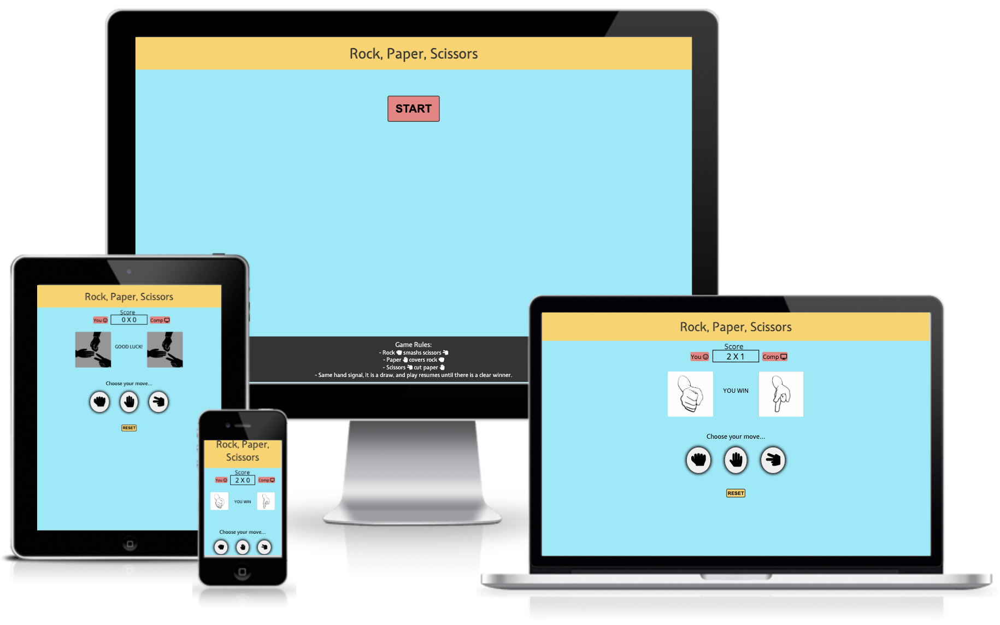
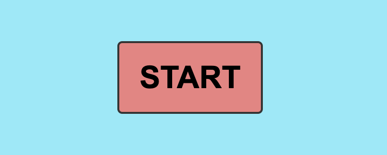
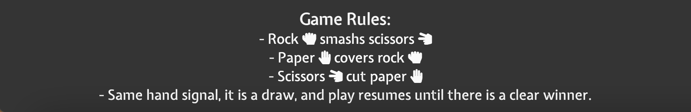
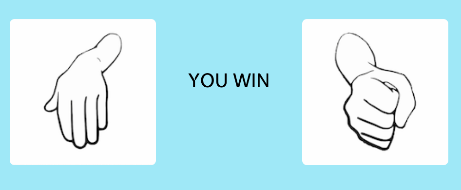

# Rock, Paper, Scissors

Rock, Paper, Scissors is a game that dates back to the Han Dinasty. People would play against each other face to face. The fact that it was face to face made it unfair, because people were able to predict each others' moves by reading their body language. 
For that reason, I decided to create this fully responsive JavaScrip game, where is not possible to take advantage of your oponent. 
This is build to challenge players that are looking to beat a computer algorithm. 
They play against the machine and random choices are generated, so it is impossible to anticipate. 
Users can also enjoy a colorful interface with modern design and a great user experience.

## Features 

### Existing Features

- __Rock Paper Scissors Title and Heading__

  - Featured on all displays, the start and main game on top of the page. The game title heading at user's eye-level. First thing the users see when they access the initial game display & throughout.
  

- __Start Game Button__

  - Featured only on the first game display, the start button will give a sense of break between displays to the user, after pressing the start button, it sets on display all the game features. The Start button changes colors when users hover over to give a sense of readiness to be pressed and improve user experience.

- __Footer Game Rules__

  - This feature helps the user understand the game and rules apply to different game scenarios and will be featured only on the first game display. The footers have a dark color to contrast with the colorful game interface, which drives the users eyes to have a look at the rules before starting the game.

- __The Score Panel__

  - This section helps the user see the exact game score, it has badges indicating the user and computer game side and score. Every time the user scores a win, its side score increments as it does the same for the computer when it wins, allowing the user to follow the game situation in real time.

- __Results and Images Choices Area__

  - This section allows the user to identify visually through images of the hand sign chosen by the user and the computer. It also displays a Win, Lost or Draw result for each game scenario based on the user and computer choices. Every time the game is started or reset, it displays the default game images and wishes user good luck!

- __Call For Action__

  - This section is a call for the user to act and choose one of the three hand sign options. It will be featured all the time only on the main game display, encouraging the user to make a move.

- __User Options Buttons__

  - This section allows the user to choose between three options to compete against a random choice of a computer. The buttons have a glow effect which helps the user identify the result of their choice in different game scenarios, red for the wrong choice, green for correct and blue for draw. These buttons change colors when users hover over to give a sense of position and signal to the user which option is about to be pressed.

- __Reset Game Button__

  - This section allows the user to reset the game to the initial game display. Every time the user hits this button, the display will bring the score to zero and the standard game images will pop up and the game will be ready to be played again. The Reset button changes colors when users hover over to give a sense of readiness to be pressed and improve the user experience.

### Features Left to Implement

- Another feature idea would be to create a best of 3 game style in a 30sec game, where the user scores as many points as possible in 30sec in a best of 3 style. The highest score is the winner.

## Testing 

This game has been put through testing since the beginning and at every stage of the building, I made use of W3C and Jigsaw validator. In addition, Google Chrome developer tool was used for troubleshooting and console.log on screen for every code step through the java script for all the functionalities that were created.

I used Google Chrome developer tool & Firefox inspector tool to make sure pages are responsive to different screen sizes and devices.

During the building process, an error encountered was due to the variable used to generate a random number for the computer's choice. I had set a const and changed to let to fix this error.

### Validator Testing 

- HTML
    - No errors were returned when passing through the official [W3C validator](https://validator.w3.org/nu/?doc=https%3A%2F%2Fmarcosmgs.github.io%2Frockpaperscissors%2F)

- CSS
    - No errors were found when passing through the official [(Jigsaw) validator](https://jigsaw.w3.org/css-validator/validator?uri=https%3A%2F%2Fmarcosmgs.github.io%2Frockpaperscissors%2F&profile=css3svg&usermedium=all&warning=1&vextwarning=&lang=en)

- JavaScript
    - No errors were found when passing through the official [Jshint validator](https://jshint.com/)
    
    - Metrics returned:
      - There are 19 functions in this file.
      - Function with the largest signature take 2 arguments, while the median is 0.
      - Largest function has 19 statements in it, while the median is 1.
      - The most complex function has a cyclomatic complexity value of 10 while the median is 1.

### Unfixed Bugs

No Unfixed Bugs left behind ;)

## Deployment

The site is deployed using GitHub Pages - [Rock, Paper, Scissors](https://marcosmgs.github.io/rockpaperscissors/).

The steps to deploy are as follows: 

1. Login (or signup) to Github.
2. Go to the repository for this project, [Marcosmgs/Rock, Paper, Scissors](https://github.com/Marcosmgs/rockpaperscissors).
3. Click the settings button.
4. Select pages in the left hand navigation menu.
5. From the source dropdown select main branch and press save.
6. The site has now been deployed, please note that this process may take a few minutes before the site goes live.

## Credits 

### Content and Media 

- The code for the user option buttons uses setTimeout to delay a style change on the buttons when clicked was taken from [Stack Overflow](https://stackoverflow.com/questions/44268612/use-settimeout-to-delay-a-style-change-on-a-button) 
- The images used for the game results area were taken from the vector graphics section of the open source website [Pixa Bay](https://pixabay.com/)
- The icons on the badges and user choice buttons were taken from [Font Awesome](https://fontawesome.com/)
