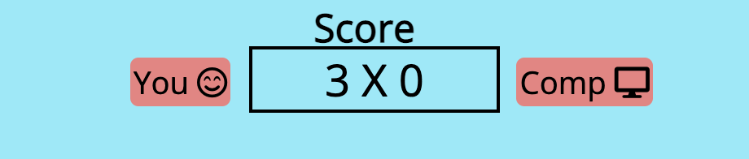

# Rock, Paper, Scissors

Rock, Paper, Scissors Game is a fully responsive JavaScrip game built to challenge players looking to beat a computer algorithm by playing against the machine where random computer choices are generated, which makes it impossible to gain an advantage over an opponent that chooses their move uniformly at random. making this game a great challenge as it differentiate to person vs person game, where it is possible to gain a significant advantage over a non-random player by predicting their move, which can be done by exploiting psychological effects or by analyzing statistical patterns of their past behavior. Therefore, this game is built to bring fairness to a game that dates back to the Han dynasty (206 BCE – 220 CE), all in a colorful interface with modern design and a great user experience!

## Features 

In this section, you should go over the different parts of your project, and describe each in a sentence or so. You will need to explain what value each of the features provides for the user, focusing on who this website is for, what it is that they want to achieve and how your project is the best way to help them achieve these things.

### Existing Features

- __Rock Paper Scissors Title and Heading__

  - Featured on all displays, the start and main game at the top of the page, the game title heading easily to the hit of the user's eyes, first thing the users sees when access the initial game display and following the main game display which will be featuring the same game title heading.

- __Start Game Button__

  - Featured on the first game display, the start button will give a sense of break between displays to the user, whereas before the users hit the start button, the user has a display showing game rules on the footer and the game title on the head, after pressing the start button, it sets on display ll the game features. The Start button changes colors when users hover over to give a sense of readiness to be pressed and improve user experience.

- __Footer Game Rules__

  - This feature helps the user understand the game and rules apply to different game scenarios and will be featured only on the first game display. The footers have a dark color to contrast with the colorful game interface, which drives the users eyes to have a look at the rules before starting the game.

- __The Score Panel__

  - This section helps the user see the exact game score, it has badges indicating the user and computer game side and score. Every time the user scores a win, its side score increments as it does the same for the computer when it wins, allowing the user to follow the game situation in real time.

- __Results and Images Choices Area__

  - This section allows the user to identify visually through images of the hand sign chosen by the user and the computer. It also displays a Win, Lost or Draw result for each game scenario based on the user and computer choices. Every time the game is started or reset, it displays the default game images and wishes user good luck!

- __Call For Action__

  - This section is a call for the user to act and choose one of the three hand sign options. It will be featured all the time only on the main game display, encouraging the user to make a move.

- __User Options Buttons__

  - This section allows the user to choose between three options to compete against a random choice of a computer. The buttons have a glow effect which helps the user identify the result of their choice in different game scenarios, red for the wrong choice, green for correct and blue for draw. These buttons change colors when users hover over to give a sense of position and signal to the user which option is about to be pressed.

- __Reset Game Button__

  - This section allows the user to reset the game to the initial game display. Every time the user hits this button, the display will bring the score to zero and the standard game images will pop up and the game will be ready to be played again. The Reset button changes colors when users hover over to give a sense of readiness to be pressed and improve the user experience.

